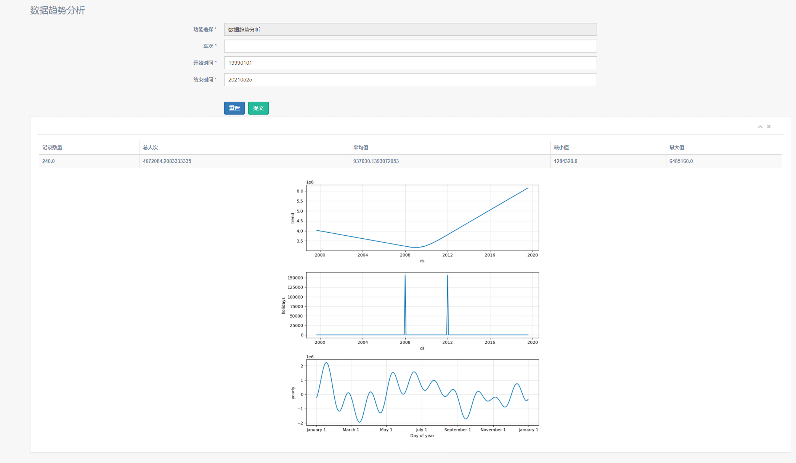

图片请分类存放于src 相对引用

# 报告

## 1. 需求分析 （单）

### 1.1 登录注册模块

### 1.2 用户信息模块

### 1.3 管理员信息模块

### 1.4 线路管理模块

### 1.5 车站管理模块

### 1.6 票务管理模块

### 1.7 车次管理模块

## 2. UML（刘 吴）（可以加点对图的描述，麻烦就算了）

### 2.1 用例图（多补几张）

1. 普通用户 用例图


2. 管理员用户 用例图


### 2.2 类图

### 2.3 顺序图(多补几张)

### 2.4 部署图

## 3.  数据库设计（金）

### 3.1 表的设计

#### 3.1.1 工作人员信息表

```
工作人员信息表主要囊括了工作人员的基本信息，包括ID号、工作人员用户名、密码和部门类型号，其中ID号为主键。
```

#### 3.1.2 用户信息表

```
用户信息表主要囊括了用户的基本信息，包括ID号，用户名、密码和用户类型号，其中ID号为主键。
```

#### 3.1.3 站点信息表

```
站点信息表主要囊括各个站点的基本信息，包括站点名、站点容量级别、开站时间和闭站时间，其中站点名为主键。
```

#### 3.1.4 线路表

```
线路表主要是各条线路的基本信息，包括线路号、名称、到达站、出发站和线路距离，其中线路号是主键，到达站和出发站的外键是站点信息表中的站点名。
```

#### 3.1.5 车类表

```
车类表描述了系统中包括的列车类型，包括该车类的类型号、一等座数和二等座数，其中类型号是主键。
```

#### 3.1.6 火车信息表

```
火车信息表主要囊括了所有火车的信息，包括车编号、类型号，其中车编号是主键，类型的外键是车类表的类型号。
```

#### 3.1.7 车次表

```
车次表主要描述了各个车次的信息，包括车次、车编号、线路号、出发时间和到达时间，其中车次是主键，车编号的外键是火车信息表的车编号，线路号的外键是线路表的编号。
```

#### 3.1.8 票价信息表

```
票价信息主要描述了系统内各类票的情况，包括票价号、车次、座位类型和票价，其中票价号是主键，车次的外键是车次表的车次。
```

#### 3.1.9 已售票信息表

```
已售票信息表记录所有的售票记录，包括票号、票价号、用户ID和座位号，其中票价号的外键是票价信息表的票价号，用户ID的外键是用户信息表的ID号。
```

### 3.2 数据库构建

```
数据库采用Mysql，数据库管理IDE选用DataGrip，具体编程采用Python3.8+flask_sqlalchemy+Pycharm实现。最后生成的数据库如下图所示。
```


### 3.3 ER图的绘制

```
基于各个表的信息，参照主键、外键约束，绘制出ER图如下所示。
```


## 4. 第四章 系统功能实现（殷 周）（主要为截图，截图配字想写就写，流程图想画就画）

### 4.1 用户端

#### 4.1.1 登录注册

#### 4.1.2 用户信息

#### 4.1.3 购买车票

#### 4.1.4 查询车票

#### 4.1.5 退订车票

### 4.2 管理端

#### 4.2.1 登录

此模块是为管理员用户登录使用，现以登录为例，介绍管理员登录模块主要的逻辑实现

1. 首先从前端的HTML读入用户名和密码，进入数据库查询结果

```python
login_error = None
login_username = request.form['login_username']
login_password = request.form['login_password']
login_user = UserStaff.query.filter(UserStaff.user_name == login_username).first()
```

2. 然后处理错误异常信息，如果产生错误，将错误信息存储在flash中，稍后会以消息闪现的方式在HTML上进行渲染，用户将继续留在登录界面

```python
if login_user is None: # 用户名错误
	login_error = 'Incorrect username'
elif not check_password_hash(login_user.password, login_password): # 密码以哈希形式存储在数据库，保证安全
	login_error = 'Incorrect password'
flash(login_error)  
```

3. 如果没有发生错误，跳转到管理员主页，并为浏览器设置cookie，免去下次用户打开浏览器重复验证身份的麻烦

```python
if login_error is None:
    session.clear()
    session['user_ID'] = login_user.staff_ID
              
    respond =  redirect(url_for('manager_bp.manager_index'))
    respond.set_cookie('user_name', login_username)
    respond.set_cookie('user_type', str(login_user.department_type_number))
```

4. 界面效果展示


#### 4.2.2 用户信息

此模块位于管理员部分，用于管理普通用户，只有超级管理员和用户管理管理员的模块权限，主要实现以下功能：

1. 普通用户的增加，相当于实际生活中，铁路工作人员帮助普通用户注册账号。点击最左侧菜单栏中“添加用户”，进入相关界面，输入用户名和用户身份，确认密码后点击提交即可。


2. 普通用户的删除，相当于实际生活中，铁路工作人员删除某购票账号。在用户信息表中点击Delete，即可删除该用户


3. 普通用户的修改，相当于实际生活中，管理员帮助某用户修改其基本账号信息。在上面的页面中点击Edit，进入对单个用户的修改页面，注意此时不能修改用户名，仅仅能修改密码和用户身份。


4. 普通用户的查看，可以查找某一特定用户所有的购票信息。在用户信息表，点击想要查询的用户名，可以看到该用户的详细信息，包括车号、线路（起始地、目的地）、座位号、座位类型等。


#### 4.2.3 管理员信息

此模块用于对管理员的管理，只有超级管理员有该模块的权限，注意超级管理员只有一个，可以注册、修改、删除、查找上述五种权限的管理员，主要功能如下：

1. 管理员注册，在菜单栏点击“添加管理员”即可，注册完成后的管理员用户，可以直接在登录界面登录，并拥有对某一模块的管理权限。


2. 管理员修改，点击管理员信息表中的Edit按钮，可以给对应的管理员修改权限和密码。


3. 管理员查找，可以直接在管理员信息表输入查找的信息，此功能基于JavaScript实现


4. 管理员删除，直接点击管理员信息表中Delete按钮，可以删除该用户


#### 4.2.4 线路管理

#### 4.2.5 车站管理

#### 4.2.6 票务管理

#### 4.2.7 车次管理

## 5. 扩展功能实现

### 5.1 基于阿里云人脸对比SDK实现的登录人脸核验

```
为进一步落实铁路购票实名制需求，特设计人脸核验功能，在用户登录时，需要核验当前登录用户人脸与数据库中存储的人脸信息是否相符，并将错误信息反馈到登录界面。具体实现思路如下图所示。
```


### 5.2 基于sketchfab实现的列车模型3D展示

```
为进一步宣扬铁路文化，普及列车发展知识，特在用户端设计了列车模型的3D展示模块，展示我国最新一代的CRH5高速列车。考虑到利用本地资源渲染模型需要存储、加载大量的静态资源，不利于多并发访问且存在诸多无意义的编程，特采用网络资源，即基于sketchfab的api实现。设置调用超链接，用户在打开网页时将自动加载网络资源，并且用户还可以利用鼠标拖动模型和设置一些参数来实现简单的交互。
```

```
页面效果图如下所示。
```


### 5.3 基于Prophet模型实现的数据趋势分析和预测

#### 5.3.1 数据源

```
分析数据采用特定时间范围内的某车次总购票人数，预测数据采用过去时间内的某车次总购票人数。
```

#### 5.3.2 Prophet模型简介

```
Prophet模型由Facebook提出并开源，其是基于非线性关系拟合的时间序列模型，并非机器学习方法。因此他无需麻烦的特征工程，用户操作友好，适用于铁路信息中的这种自动化处理。并且其将快速的完成模型训练更新，符合铁路系统数据更新较为频繁的现状。同时，其将对假期和特征事件建模，如额外关注国庆节、劳动节等假期；其支持自动分析和手动添加周期性变化规律，如一周内的趋势。这些特征符合铁路旅客数据的周期性和特殊性。
```

```
我们利用chinesecalendar库函数寻找数据时间范围内的所有holiday，添加特征事件。并且添加了年、月、周等周期性因素。
```

#### 5.3.3 编程逻辑

```
具体的编程逻辑如下图所示。
```


#### 5.3.4 效果展示

1、数据预测

```
输入为车次、预测周期和预测频率，输出为一个表格和一张图片。其中表格列为时间、预测值、预测上限值和预测下限值。图片中黑点为历史数据，蓝色线为拟合情况，蓝色带为范围值。
```


2、数据分析

```
输入为车次、开始时间和结束时间，输出为一个表格和一组图片，其中表格为数据的描述性分析。图片为数据趋势分析，包括数据的总变化趋势，特殊事件带来的影响和周期性影响因素。
```

