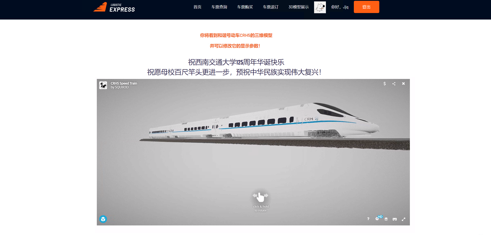

图片请分类存放于src 相对引用

# 报告

## 0. 分工安排

|    学号    |  姓名  | 工作内容                                                     |
| :--------: | :----: | ------------------------------------------------------------ |
| 2018114228 | 殷子浩 | 参与数据库设计，完成管理员端鉴权、认证、模糊搜索、车次、<br />票务管理模块的前端、后端开发，区分用户身份与坐等，github工作流管理 |
| 2018115563 | 周依萍 | 参与数据库设计，用户端对页面的前端框架进行二次调整；<br />管理端负责整体页面框架决定与调整，车站、线路模块的前、后端开发 |
| 2018110753 | 金嘉淇 | 参与数据库设计与实现；ER图；部署图；用户端鉴权、认证；<br />人脸识别扩展；数据分析预测前后端开发；列车3D展示模块前后端开发；GitHub commit最多 |
| 2018111062 | 单招文 | 参与数据库设计，用户端：前端html框架，css初级美化<br />模糊搜索，js读取后端数据，类图、PPT制作 |
| 2018112268 | 刘立敏 | 参与数据库设计，用户端后端逻辑功能实现，模糊搜索， 后端实现<br />根据用户类型显示票价，顺序图绘制 |
| 2018113562 | 吴国桐 |                                                              |

## 1. 需求分析

### 1.1 登录注册模块

#### 1.1.1目标

实现功能完备，带较强有健壮性的登陆注册页面

#### 1.1.2 用户特点

分为两类人群：

- 用户：从电脑小白到电脑高手都有可能是我们的潜在用户
- 管理员：等级森严，不同等级的管理员权限不同

#### 1.1.3 功能说明

- 默认页面是登陆界面
- 登陆界面下侧分别提供注册账户按钮和忘记密码按钮
- 登陆页面右上角提供管理员登陆入口

### 1.2 用户信息模块

#### 1.2.1目标

实现功能完备，带较强有健壮性的用户信息模块

#### 1.2.2 用户特点

- 具有定期更换头像的需求
- 具有定期更换密码的需求
- 具有修改电话号码的需求

#### 1.2.3 功能说明

默认界面是一个表格，分别显示用户的用户名，真实姓名，身份证，电话号码，用户类型，头像等，其中电话号码和头像可以进行修改。

### 1.3 管理员信息模块

#### 1.3.1目标

实现功能完备，带较强有健壮性的管理员信息模块

#### 1.3.2 用户特点

具有以下两种类型的管理员

- 超级管理员，可以对其他所有的管理员的权限进行管理，并且拥有所有模块的权限
- 普通管理员，权限由超级管理员分配，并且可以对具有权限的模板进行管理

#### 1.3.3 功能说明

- 对于超级管理员，页面左侧除了对线路车站，票务，车次，用户进行管理之外，还有一个管理员模块对管理员进行管理
- 对于普通管理员，页面左侧只能进入自己拥有权限的模块，无权限的模块将无法进入。

### 1.4 线路管理模块

#### 1.4.1目标

实现功能完备，带较强有健壮性的线路信息模块

#### 1.4.2 用户特点

- 具有查看线路功能
- 具有添加线路功能

#### 1.4.3 功能说明

- 对于查看线路，默认界面是一个表格，表格每一行显示一条线路，并且具有翻页，跳转，以及模糊搜索功能。

- 对于添加线路，默认界面是一个表格，需要输入线路名称，出发站，到达站，实际里程等信息才可以实现添加线路的功能。

### 1.5 车站管理模块

#### 1.5.1目标

实现功能完备，带较强有健壮性的车站管理信息模块

#### 1.5.2 用户特点

- 具有查看车站功能
- 具有添加车站功能

#### 1.5.3 功能说明

- 对于查看车站，默认界面是一个表格，表格每一行显示一个车站的信息，并且具有翻页，跳转，以及模糊搜索功能。

- 对于添加车站，默认界面是一个表格，需要输入车站名，车站等级等信息才可以实现添加车站的功能。

### 1.6 票务管理模块

#### 1.6.1目标

实现功能完备，带较强有健壮性的票务管理信息模块

#### 1.6.2 用户特点

- 具有查看已购票功能
- 具有进行车票购买功能（实现售票员功能）

#### 1.6.3 功能说明

- 对于查看已售出票，默认界面是一个表格，表格每一行显示一个车站的信息，并且具有翻页，跳转，以及模糊搜索功能。

- 对于车票购买功能，默认界面是一个表格，需要输入用户凭证类型，用户凭证，车次号，出发日期，座位等级等才能够进行购票。

### 1.7 车次管理模块

#### 1.7.1目标

实现功能完备，带较强有健壮性的车次管理信息模块

#### 1.7.2 用户特点

- 具有查看车次功能
- 具有添加车次功能

#### 1.7.3 功能说明

- 对于查看车次，默认界面是一个表格，表格每一行显示一个车次的信息，并且具有翻页，跳转，以及模糊搜索功能。

- 对于添加车次，默认界面是一个表格，需要输入，车次号，车号，线路号，出发时间和到达时间等信息才可以实现添加车次的功能。

## 2. UML（刘 吴）（可以加点对图的描述，麻烦就算了）

### 2.1 用例图（多补几张）

1. 普通用户 用例图


2. 管理员用户 用例图


------

### 2.2 类图

------

### 2.3 顺序图(多补几张)

1. 登录 顺序图

<font color=#808080 size=2>  **传入参数：**用户名(*User_id*)、密码(*password*)</font>


2. 普通用户 购票、退票 顺序图

+ 购票

  <font color=#808080 size=2> **传入参数：**用户ID(*User_id*)、出发站(*departure_station*)、到达站(*arrival_time*)、出发时间(*departure_time*)、到达时间(*arrival_time*)、座位类型(*seat_type*)</font>

  

+ 退票

  <font color=#808080 size=2> **传入参数：**用户ID(*User_id*)</font>
  
  
3. 管理员用户 添加线路、修改站点、删除车票 顺序图

+ 添加线路

  <font color=#808080 size=2> **传入参数：**线路号(*Line_id*)、线路名(*Line_name*)、出发站(*departure_station*)、到达站(*arrival_time*)、线路距离(*Line_distance*)</font>

  

+ 修改站点

  <font color=#808080 size=2> **传入参数：**车站名(*site_name*)、车站等级(*site_type*)</font>

  

+ 删除车票

  <font color=#808080 size=2> **传入参数：**票号(*fare_id*)</font>
  
  
  
  -----

### 2.4 部署图

## 3.  数据库设计（金）

### 3.1 表的设计

#### 3.1.1 工作人员信息表

```
工作人员信息表主要囊括了工作人员的基本信息，包括ID号、工作人员用户名、密码和部门类型号，其中ID号为主键。
```

#### 3.1.2 用户信息表

```
用户信息表主要囊括了用户的基本信息，包括ID号，用户名、密码和用户类型号，其中ID号为主键。
```

#### 3.1.3 站点信息表

```
站点信息表主要囊括各个站点的基本信息，包括站点名、站点容量级别、开站时间和闭站时间，其中站点名为主键。
```

#### 3.1.4 线路表

```
线路表主要是各条线路的基本信息，包括线路号、名称、到达站、出发站和线路距离，其中线路号是主键，到达站和出发站的外键是站点信息表中的站点名。
```

#### 3.1.5 车类表

```
车类表描述了系统中包括的列车类型，包括该车类的类型号、一等座数和二等座数，其中类型号是主键。
```

#### 3.1.6 火车信息表

```
火车信息表主要囊括了所有火车的信息，包括车编号、类型号，其中车编号是主键，类型的外键是车类表的类型号。
```

#### 3.1.7 车次表

```
车次表主要描述了各个车次的信息，包括车次、车编号、线路号、出发时间和到达时间，其中车次是主键，车编号的外键是火车信息表的车编号，线路号的外键是线路表的编号。
```

#### 3.1.8 票价信息表

```
票价信息主要描述了系统内各类票的情况，包括票价号、车次、座位类型和票价，其中票价号是主键，车次的外键是车次表的车次。
```

#### 3.1.9 已售票信息表

```
已售票信息表记录所有的售票记录，包括票号、票价号、用户ID和座位号，其中票价号的外键是票价信息表的票价号，用户ID的外键是用户信息表的ID号。
```

### 3.2 数据库构建

```
数据库采用Mysql，数据库管理IDE选用DataGrip，具体编程采用Python3.8+flask_sqlalchemy+Pycharm实现。最后生成的数据库如下图所示。
```


### 3.3 ER图的绘制

```
基于各个表的信息，参照主键、外键约束，绘制出ER图如下所示。
```


## 4. 第四章 系统功能实现（殷 周）（主要为截图，截图配字想写就写，流程图想画就画）

### 4.1 用户端

#### 4.1.1 首页

本模块为用户系统首页，同时也是整个系统的主页，为默认页

1.默认页代码，默认用户名为游客（html中设置）

```python
@app.route('/')
def hello():
    return redirect(url_for('user_bp.user_index'))
```

2.界面展示


#### 4.1.2 登录注册

此模块是为普通用户登录注册以及忘记密码等相关功能

##### 4.1.2.1 登陆

首先介绍登录功能主要的逻辑实现

1. 获取前端输入的用户名与密码，并在数据库数据查询

```python
login_username = request.form['user']
login_password = request.form['password']
login_user = User.query.filter(User.user_name == login_username).first()
```

2. 处理错误抛出异常信息，采用flash在前端渲染

```python
if login_user is None:
    login_error = 'User {} does not exist!'.format(login_username)
elif login_user.password != login_password:
    login_error = 'Incorrect password!'
```

3. 若无错误，再次进入主页，但会显示采用设置好的cookie来获取对应用户名

```python
if login_error is None:
    session.clear()
    session['user_ID'] = login_user.user_ID
    respond = redirect(url_for('user_bp.user_index'))
    respond.set_cookie('customer_id', str(login_userid))
    respond.set_cookie('customer_name', login_username)
```

4. 页面展示


##### 4.1.2.2 注册

1. 获取前端输入的用户名、密码、重复密码、身份与头像信息

```python
reg_username = request.form.get('user')
reg_password1 = request.form.get('password1')
reg_password2 = request.form.get('password2')
if request.form.get('browser') == '成人':
  	user_type = 0
else:
  	user_type = 1
```

2. 进行输入信息的简单验证，例如二次密码是否一致等

```python
if reg_password1 != reg_password2:
  	reg_error = 'Inconsistent password.'
elif User.query.filter(User.user_name == reg_username).first() is not None:
  	reg_error = 'User {} is already registered.'.format(reg_username)
```

3. 若无错误，则向数据库提交，向用户表添加一条新用户信息

```
reg_user = User(user_name=reg_username, password=reg_password1, user_type_number=user_type)
db.session.add(reg_user)
db.session.commit()
```

4. 页面展示


##### 4.1.2.3 忘记密码

若进入忘记密码逻辑，可直接输入用户名与新密码，

1. 获取前端输入的用户名、新密码、重复密码

```python
reg_username = request.form.get('user')
reg_password1 = request.form.get('password1')
reg_password2 = request.form.get('password2')
```

2.页面展示


#### 4.1.2 用户信息

本模块为登陆后显示个人信息页面，且可直接修改

1. 采用cookie获取用户名，根据此用户名在数据库查询获取相关信息进行显示

```python
reg_username = request.cookies.get('customer_name')
user=User.query.filter(User.user_name == reg_username).first()
```

2. 页面展示


#### 4.1.3 购买车票

1. 购票逻辑第一步为输入起始站、终点站、座等与出发时间

```python
buy_arrival_station = request.form['arrival_station']
buy_departure_station = request.form['departure_station']
temp = request.form['departure_time']
buy_departure_time = datetime.datetime.strptime(temp, "%H:%M:%S")
seat_type = request.form['seat_type']
```

2. 购买前置查询页面

3. 后端通过cookie获取的用户身份以及输入的数据查询对应车次

```python
checkbuytickets = db.session.query(FareInformation.fare_ID, TrainNumber.train_number_ID,Line.line_ID, FareInformation.seat_type,
Line.departure_station, Line.arrival_station,TrainNumber.departure_time, TrainNumber.arrival_time). \
filter(TrainNumber.train_number_ID == FareInformation.train_number_id,
       TrainNumber.line_ID == Line.line_ID,
       Line.departure_station == buy_departure_station,
       Line.arrival_station == buy_arrival_station,
       FareInformation.seat_type == buy_seat_type,
       TrainNumber.departure_time >= buy_departure_time).all()
site_list = db.session.query(Site).filter().all()
```

4.购买页面


#### 4.1.4 查询车票

用户端提供车票的检索功能


#### 4.1.5 退订车票

用户端提供车票退订的功能，进入模块显示当前用户的所有购票记录，在各行末尾设置一个退订按钮，点击实现退票


### 4.2 管理端

#### 4.2.1 登录

此模块是为管理员用户登录使用，现以登录为例，介绍管理员登录模块主要的逻辑实现

1. 首先从前端的HTML读入用户名和密码，进入数据库查询结果

```python
login_error = None
login_username = request.form['login_username']
login_password = request.form['login_password']
login_user = UserStaff.query.filter(UserStaff.user_name == login_username).first()
```

2. 然后处理错误异常信息，如果产生错误，将错误信息存储在flash中，稍后会以消息闪现的方式在HTML上进行渲染，用户将继续留在登录界面

```python
if login_user is None: # 用户名错误
	login_error = 'Incorrect username'
elif not check_password_hash(login_user.password, login_password): # 密码以哈希形式存储在数据库，保证安全
	login_error = 'Incorrect password'
flash(login_error)  
```

3. 如果没有发生错误，跳转到管理员主页，并为浏览器设置cookie，免去下次用户打开浏览器重复验证身份的麻烦

```python
if login_error is None:
    session.clear()
    session['user_ID'] = login_user.staff_ID
              
    respond =  redirect(url_for('manager_bp.manager_index'))
    respond.set_cookie('user_name', login_username)
    respond.set_cookie('user_type', str(login_user.department_type_number))
```

4. 界面效果展示


#### 4.2.2 用户信息

此模块位于管理员部分，用于管理普通用户，只有超级管理员和用户管理管理员的模块权限，主要实现以下功能：

1. 普通用户的增加，相当于实际生活中，铁路工作人员帮助普通用户注册账号。点击最左侧菜单栏中“添加用户”，进入相关界面，输入用户名和用户身份，确认密码后点击提交即可。


2. 普通用户的删除，相当于实际生活中，铁路工作人员删除某购票账号。在用户信息表中点击Delete，即可删除该用户


3. 普通用户的修改，相当于实际生活中，管理员帮助某用户修改其基本账号信息。在上面的页面中点击Edit，进入对单个用户的修改页面，注意此时不能修改用户名，仅仅能修改密码和用户身份。


4. 普通用户的查看，可以查找某一特定用户所有的购票信息。在用户信息表，点击想要查询的用户名，可以看到该用户的详细信息，包括车号、线路（起始地、目的地）、座位号、座位类型等。


#### 4.2.3 管理员信息

此模块用于对管理员的管理，只有超级管理员有该模块的权限，注意超级管理员只有一个，可以注册、修改、删除、查找上述五种权限的管理员，主要功能如下：

1. 管理员注册，在菜单栏点击“添加管理员”即可，注册完成后的管理员用户，可以直接在登录界面登录，并拥有对某一模块的管理权限。


2. 管理员修改，点击管理员信息表中的Edit按钮，可以给对应的管理员修改权限和密码。


3. 管理员查找，可以直接在管理员信息表输入查找的信息，此功能基于JavaScript实现


4. 管理员删除，直接点击管理员信息表中Delete按钮，可以删除该用户


#### 4.2.4 线路管理

1. 该模块可供对应权限管理员浏览并编辑，当前铁路数据库所有的线路信息


2. 可对应进行模糊搜索，例如查看所有含成都站的线路信息


3. 对应插件可直接对数据进行复制、打印等操作，例如打印


4. 可通过操作栏进行删除，删除则直接从数据库级联删除


5. 点击Edit则可进入修改页面，以上图1号线为例，将里程修改为2345


6.同时也可增添一个新线路，但线路的站点必须存在于车站表，例如接下来演示将Beijing- Chengdu删除后再重新添加


#### 4.2.5 车站管理

车站模块逻辑功能与线路模块相似，同样可实现增删改查，车站表是更为基础的表项，不依赖于任何外键

1. 查询功能（同样具有模糊查找和插件功能）


2. 修改功能（修改站点等级）


3.删除功能（同样位于操作栏），删除后级联删除相关线路


4.增加站点


#### 4.2.6 票务管理

1. 管理员可以通过本系统的票务模块实现对已购票的查询和查看


管理员可以通过右上角的检索框，根据票号、车次号、线路名称、用户号、用户名等关键词进行模糊搜索

下面以检索用户llm的购买情况为例


也可以通过点按表头，实现根据某一个特殊关键字的排序，例如根据线路关键字排序，并设置页面上能够显示的条目数量。


2. 管理员可以通过点击Action-Delete 按钮实现对一张票进行退票的操作
3. 管理员能够使用本系统中的票务子系统，实现为用户购票

我们提供根据用户名，用户号两种方式进行购票


车次号提供模糊搜索匹配的下拉框功能，提示管理员用户方便输入


输入错误时，强制要求重新输入


点击check查询价格，价格按账户类型（学生、成人）、座等、车次号变化


#### 4.2.7 车次管理

车次管理模块提供车次的查看、查询功能，可以在网页右上角进行条目内容的模糊匹配查询，在左上角进行页面条目量设置


类似的，车次添加界面要求指定一个车次号作为唯一凭证，并根据提示选择车号、线路号，当输入错误时强制要求重新输入，在时间选择控件中设置时间，点按添加即可完成添加


## 5. 扩展功能实现

### 5.1 基于阿里云人脸对比SDK实现的登录人脸核验

```
为进一步落实铁路购票实名制需求，特设计人脸核验功能，在用户登录时，需要核验当前登录用户人脸与数据库中存储的人脸信息是否相符，并将错误信息反馈到登录界面。具体实现思路如下图所示。
```


### 5.2 基于sketchfab实现的列车模型3D展示

```
为进一步宣扬铁路文化，普及列车发展知识，特在用户端设计了列车模型的3D展示模块，展示我国最新一代的CRH5高速列车。考虑到利用本地资源渲染模型需要存储、加载大量的静态资源，不利于多并发访问且存在诸多无意义的编程，特采用网络资源，即基于sketchfab的api实现。设置调用超链接，用户在打开网页时将自动加载网络资源，并且用户还可以利用鼠标拖动模型和设置一些参数来实现简单的交互。
```

```
页面效果图如下所示。
```



### 5.3 基于Prophet模型实现的数据趋势分析和预测

#### 5.3.1 数据源

```
分析数据采用特定时间范围内的某车次总购票人数，预测数据采用过去时间内的某车次总购票人数。
```

#### 5.3.2 Prophet模型简介

```
Prophet模型由Facebook提出并开源，其是基于非线性关系拟合的时间序列模型，并非机器学习方法。因此他无需麻烦的特征工程，用户操作友好，适用于铁路信息中的这种自动化处理。并且其将快速的完成模型训练更新，符合铁路系统数据更新较为频繁的现状。同时，其将对假期和特征事件建模，如额外关注国庆节、劳动节等假期；其支持自动分析和手动添加周期性变化规律，如一周内的趋势。这些特征符合铁路旅客数据的周期性和特殊性。
```

```
我们利用chinesecalendar库函数寻找数据时间范围内的所有holiday，添加特征事件。并且添加了年、月、周等周期性因素。
```

#### 5.3.3 编程逻辑

```
具体的编程逻辑如下图所示。
```


#### 5.3.4 效果展示

1、数据预测

```
输入为车次、预测周期和预测频率，输出为一个表格和一张图片。其中表格列为时间、预测值、预测上限值和预测下限值。图片中黑点为历史数据，蓝色线为拟合情况，蓝色带为范围值。
```


2、数据分析

```
输入为车次、开始时间和结束时间，输出为一个表格和一组图片，其中表格为数据的描述性分析。图片为数据趋势分析，包括数据的总变化趋势，特殊事件带来的影响和周期性影响因素。
```

![趋势分析](src/数据库部分/趋势分析.png

## 6. 服务器（吴）

